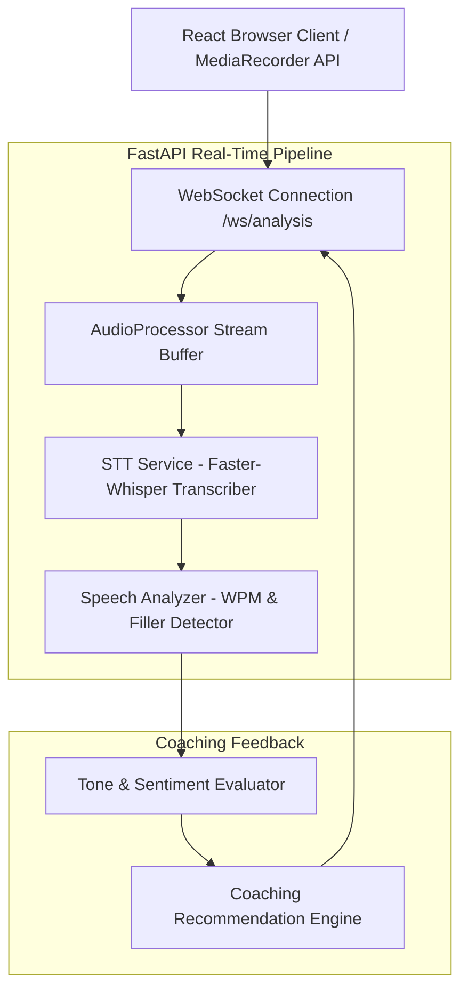

# InterviewSense — AI-Assisted Interview Practice Platform

> **Status**: 🟡 Prototype / Active Development  
> **Target Identity**: InterviewSense  
> **License**: MIT License ([LICENSE](LICENSE))  

InterviewSense is a real-time speech analytics and interview practice platform built with **FastAPI**, **WebSockets**, **Faster-Whisper**, **React 18**, and **Tailwind CSS**, providing instant feedback on speech pace, filler words, tone, and delivery confidence.


---

## Overview

Delivering confident interview answers requires controlling speech cadence, minimizing verbal fillers, and maintaining a balanced tone. **InterviewSense** processes live microphone audio streams via WebSockets, transcribes spoken text, calculates speaking rate (Words Per Minute - WPM), detects hesitation fillers (`um`, `uh`, `like`, `basically`), and returns instant coaching recommendations.

---

## Why I Built It

I built InterviewSense to explore real-time audio stream processing, WebSocket bi-directional communication, speech-to-text transcription pipelines, and audio signal analysis. Building InterviewSense required managing binary audio buffers, integrating local Whisper model inference, and calculating live speech metrics and returning feedback through a WebSocket-based processing pipeline.


---

## Architecture & Data Flow



For complete setup instructions, see [`docs/SETUP_GUIDE.md`](docs/SETUP_GUIDE.md).

---

## Key Features & Systems Design

- **WebSocket Audio Stream Ingestion**: Fast asynchronous WebSocket endpoint (`main.py` `/ws/analysis`) receiving raw binary audio chunks.
- **Speech-to-Text Transcription**: `stt_service.py` wrapping `faster-whisper` for low-latency local speech recognition.
- **Speech Pace & WPM Calculation Engine**: `analysis.py` calculates words per minute in real-time, categorizing pace as optimal (110–160 WPM), too fast (>160 WPM), or too slow (<110 WPM).
- **Filler Word Detection**: Extracts verbal hesitations (`um`, `uh`, `like`, `basically`, `you know`, `literally`) and prompts targeted delivery improvements.
- **Tone & Sentiment Evaluation**: Performs sentiment classification to evaluate interview response confidence.
- **Modern React & Tailwind CSS Interface**: Responsive client interface (`frontend/src/`) rendering live WPM gauges, filler count trackers, and real-time advice cards.

---

## Technical Stack

| Layer | Technologies |
|---|---|
| **Backend & WebSockets** | Python 3.10+, FastAPI, Uvicorn, WebSockets |
| **Speech & Audio Processing** | `faster-whisper`, PyTorch, `numpy`, `scipy` |
| **NLP & Sentiment** | `textblob`, `nltk`, regular expressions |
| **Frontend Framework** | React 18, Vite, TypeScript, Tailwind CSS |
| **Testing & Verification** | Python standard `unittest` framework |

---

## Repository Structure

```
InterviewSense/
├── backend/
│   ├── tests/
│   │   ├── test_analysis.py       # Speech rate & filler word unit tests
│   │   └── test_audio_processor.py# Audio buffer & stream processing tests
│   ├── analysis.py                # WPM, filler word, & sentiment analyzer
│   ├── audio_processor.py         # Binary audio buffer processor
│   ├── main.py                    # FastAPI app & WebSocket endpoint
│   ├── requirements.txt           # Python dependencies
│   ├── stt_service.py             # Faster-Whisper speech-to-text service
│   └── stt_service_fallback.py    # Lightweight speech recognition fallback
├── frontend/
│   ├── package.json               # React frontend dependencies
│   ├── vite.config.ts             # Vite build configuration
│   └── src/                       # Audio recording & live feedback UI
├── docs/
│   └── SETUP_GUIDE.md             # Environment setup guide
├── .env.example                   # Safe environment variable configuration template
├── LICENSE                        # MIT License
└── README.md                      # Project documentation
```

---

## Installation & Setup

### Prerequisites
- Python 3.10+
- Node.js 18+

### 1. Setup Backend

```bash
# Clone repository
git clone https://github.com/Balu-Annapureddy/InterviewSense.git
cd InterviewSense/backend

# Create virtual environment
python -m venv .venv

# Activate virtual environment
# Windows (PowerShell):
.\.venv\Scripts\Activate.ps1
# Linux/macOS:
# source .venv/bin/activate

# Install dependencies
pip install -r requirements.txt

# Start backend server
python main.py
```

The FastAPI backend will start at `http://localhost:8000`.

### 2. Setup Frontend

In a separate terminal:

```bash
cd InterviewSense/frontend
npm install
npm run dev
```

Open `http://localhost:5173` in your browser.

---

## Testing

Automated unit tests are located in `backend/tests/` (6 unit tests covering WPM calculation, filler word detection, fast/slow speech recommendations, and audio stream buffer processing).

Run the test suite:

```bash
cd backend
.\.venv\Scripts\python.exe -m unittest discover tests
```

---

## Security Audit Notice

An audit of source files found no obvious hardcoded credentials. Configuration uses optional environment variables (`OPENAI_API_KEY`).

---

## Limitations

- **Hardware Acceleration**: Local `faster-whisper` transcription defaults to CPU computation; GPU acceleration (CUDA) can be enabled via `WHISPER_DEVICE=cuda`.
- **Audio Capture**: Requires browser microphone permissions and MediaRecorder API compatibility.

---

## License

This project is licensed under the MIT License — see the [`LICENSE`](LICENSE) file for details.
